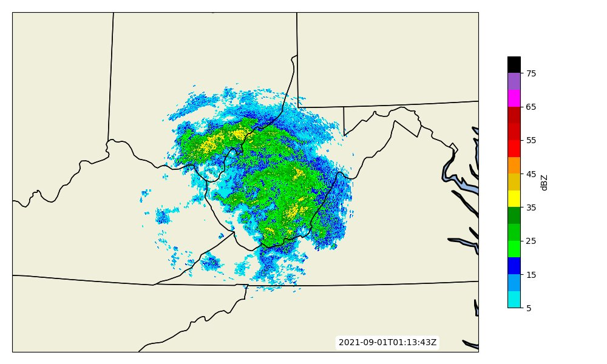

# AWS Radar GUI Python
Plot AWS Hosted NEXRAD Level 2 Data in an interactive GUI for any station in the U.S.

*David* *Coe*
*UMass* *Lowell* *-* *2021*

# AWS_Radar_GUI_Tkinter_Outline
Provides the outline and setup of the GUI interface.

To run, the user needs to first pick a location in the Continental U.S. This is done through clicking the *Pick Radar Location* button. Once clicked, a pop up screen appears featuring a map of the Continental U.S. Clicking anywhere on the map returns to the program the LAT/LON point where clicked. This is input into the radar query and automatically returns the closest radar to that point. User will also need to input a date in *mmddyyyy* format as well as a start and end hour *hh* (can be the same hour).

Once this is done, click submit and the program will plot the first available time! Then by clicking the *forward* and *back* arrow keys, the previous and next times will be plotted.

**Note:** The program can take up to a minute to plot some of the data, working out a few bugs in the code currently.

The *Save as* button can be used to save the currently displayed image as a png file.

The *make gif* button will make a gif of all available times for the chosen radar site on the chosen date. **This process may take awhile as each image has to be made before the gif can be made. Images are saved to a temp directory and removed after the gif is made**
