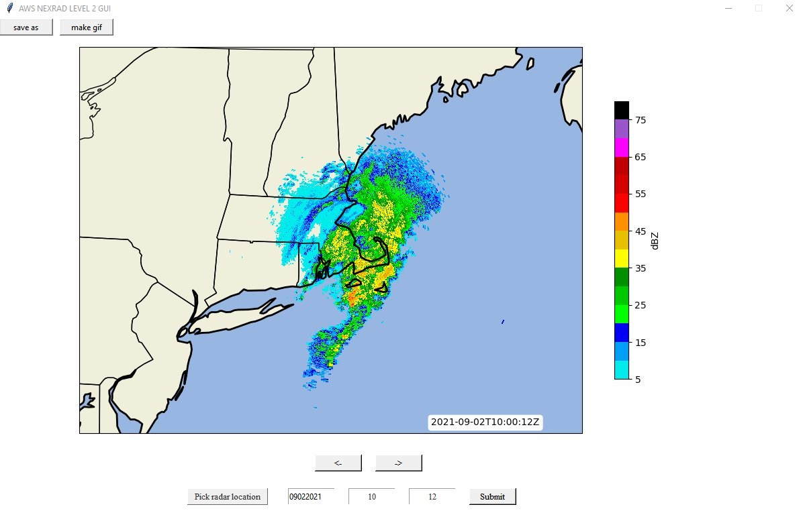

# AWS Radar GUI Python
Plot AWS Hosted NEXRAD Level 2 Data in an interactive GUI for any station in the U.S.

*David* *Coe*
*UMass* *Lowell* *-* *2021*

# AWS_Radar_GUI_Tkinter_Outline
Provides the outline and setup of the GUI interface.

# Red Noise Test

**ar1rand_func** contains the ar1rand function. This takes the data that was run through kmeans and creates a red noise dataset from it. This dataset is then run through **kmeans_ci2** using the same clustering approach as before to determine **CI** values for the **90% confidence interval** of the dataset. The confidence interval is determined by running the red noise data through **kmeans_ci2** 1000 times, sorting the resulting **CI** values, and taking the 50th and 950th **CI** values as our **90% confidence interval**.

The graph above shows the **CI** value, **90% confidence interval** (red line), and **90% confidence interval** (grey shading). Any values that fall above the red line/shaded region are considered significant. In this case, we see that the **CI** value for the 7 cluster solution lies above the **90% confidence interval**, so we would choose a 7 cluster solution in this case.

**Note:** Multiple values can fall above the **90% confidence interval**. In these cases, it is pertinent to compare the clusters of the possible solutions to each other. 
* Do the composites look similar?
* Compare the values and their assignments between the different solutions. Does one value fall into different clusters depending on the solution?
* If one value falls into a different cluster depending on the solution, does the newly formed cluster it is in make sense, or is it just a derivation of another cluster? If so, the lower cluster solution may provide better answers.

